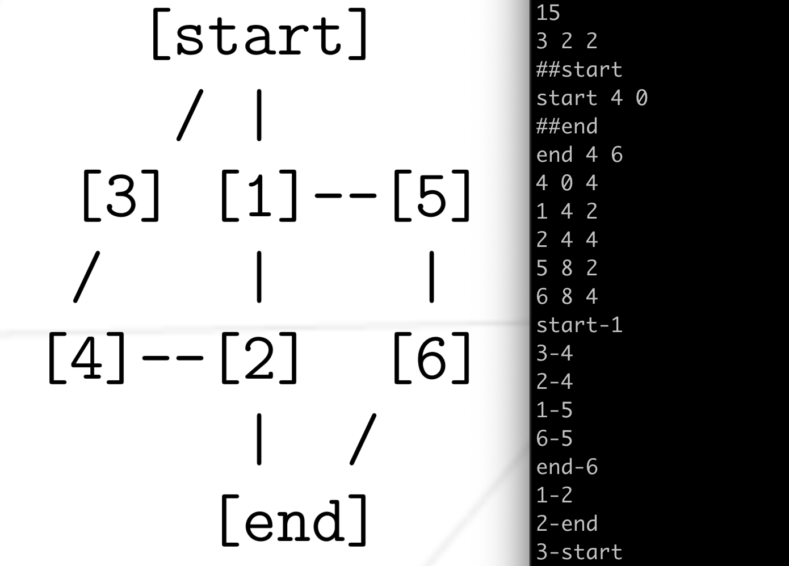
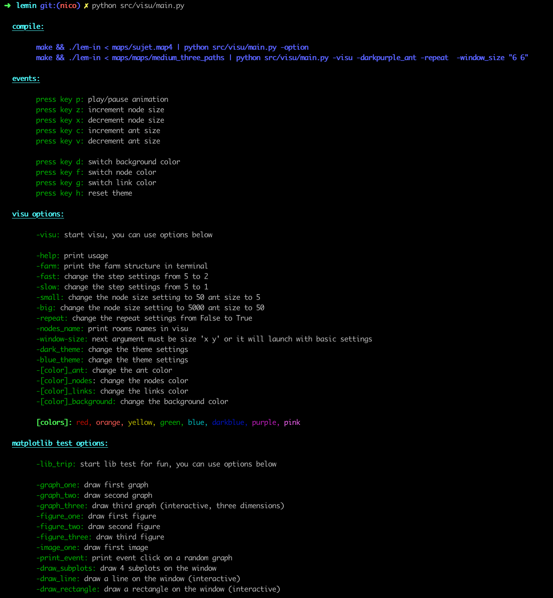
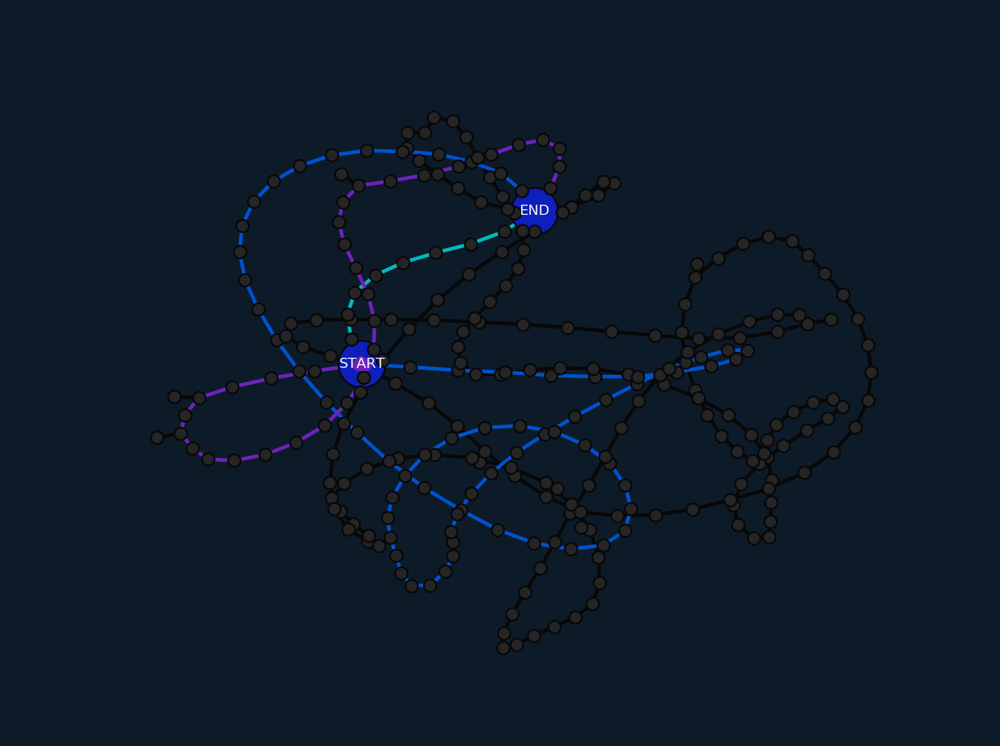
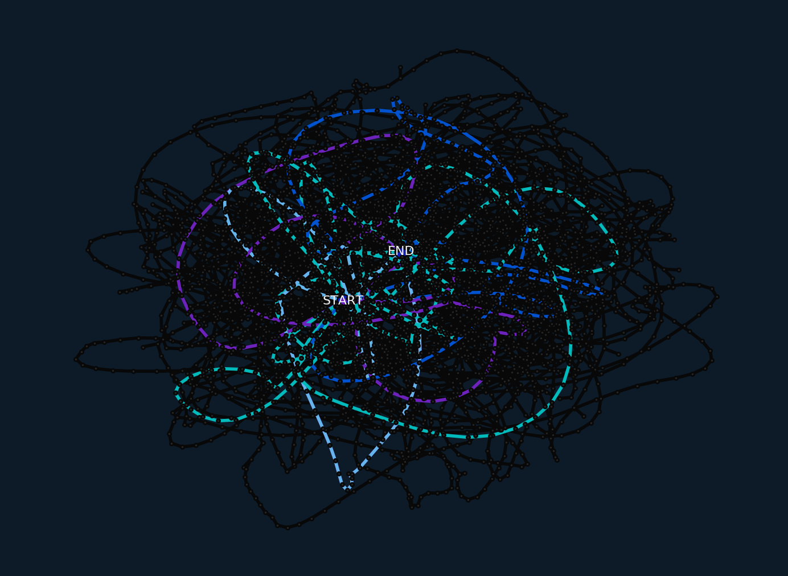

# Lem-in

Lem-in is an initiation to graph theory. Students are asked to work on an algorithm to optimize flow of ants through a maze composed of rooms linked between each others.
It's an opportunity to work on graph traversal algorithm such as dfs/bfs (deepth & breath first search), flow optimisation algorithms such as Ford-Fulkerson or 
edmond karp

## Input format

### Map example:



```
Ant: a unit of flow
Room: node
Link: edge
```

At the begining of the game, all ants are packed in start. 
Each turn ants can move, but they can't be multiple ants in a room or a link (except start and end rooms).

In this project we seek to optimized the number of turns we need to move all ants from start to end as well as the time needed to run the algorithm.

## Project

The first part of the project consist to parse all data on stdin and store them under a data structure that represent our graph.
The second part is the algorithm that compute the best combinaison of moves
The thrid part is the solution output that print on stdin the list of moves to do
The fourth and optionnal part is a visualisator that read the algorithm output and create a graphic display of it.


## Parsing

We read stdin to get all infos (number of ants, all rooms, all links between rooms ...)

We use mainly list because they are easy to use and allow us to manipulate and record data with a lot of freedom. We could have use a hash table, a binary tree or a table of list but we didn't spend time implementing this because we under estimate the time parsing would take. 

At the end of the project, we figured out parsing was taking as much as three quater of the total run time, but reworking the data structure would mean making tremendous changes to the project so we just took some time to optimised our list manipulation, and it was sufficient to be under the 3 sec, so we can get all points here.

## Algorithm

Our algorithm use a modify version of the bfs algorithm. We also use a queue and add nodes to that queue, the main difference is that when we discover a path, we mark links taken in a direction as "full". 

Each time our bfs return a new path, we update a residual graph that only represent the state of the path taken at the moment. When we update this graph, we check if a link is taken in both direction, and if this is the case, we cut this link out of the residual graph.

The task of checking if a link can be taken, and in which direction this link can be taken is done in the bfs. Because of that, the bfs will stop returning paths as soon as start node links are taken or have no connection to end.

Each time we update the residual graph, we compute the number of moves we would need to do to move all ants from start to end, using this version of the graph. We keep the shortest path and continue untill we have used all possible paths.

Then we have our best case solution and we send this path to the print functions.


## Output format

Once we now witch configuration is the best, we put it in a buffer and print it when it's full or when there is nothing left to add in it. This output will be use by the graphic display.


## Graphic display

The visual mode for this project requires networkX and matplotlib. To install them: 

* [NetworkX](https://networkx.github.io/) - Used to generate the nodes, connections and node placement in the visualizer
* [Matplotlib](https://matplotlib.org/) - Plot the colorful dots represe

```
pip3 install netowrkX
pip3 install matplotlib
```


### Usage:



### Simple graph:


### Medium graph:


### Big graph:

